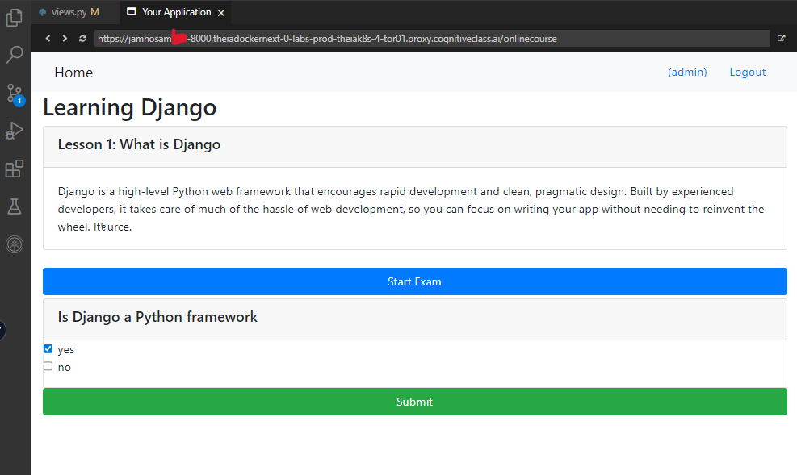

# IBM Back-End Development Professional Certificate - Django Application Development with SQL and Databases Final Project: Enhanced Online Course App with New Assessment Feature, SQL Integration, and Bootstrap Styling

## Overview

This repository contains the completed final project for the "Django Application Development with SQL and Databases" course offered by IBM on Coursera, part of the Back-End Development Professional Certificate. The project involves enhancing a pre-built Online Course application by adding a new assessment feature. As a back-end developer, I implemented models for questions, choices, and submissions; registered them in the Django admin; updated templates with Bootstrap styling; created views for exam submission and result evaluation; and ensured seamless integration with SQL databases (using SQLite3 by default).

Key accomplishments include:
- Designing and implementing database models for assessments with Many-to-One and Many-to-Many relationships.
- Enabling admin-site management for creating and editing course content, questions, and choices.
- Updating the course detail template to display exams with multiple-choice questions.
- Developing views to handle form submissions, evaluate answers, and display results with pass/fail logic.
- Styling the UI with Bootstrap for a responsive, user-friendly experience.
- Testing the application thoroughly, including passing and failing exam scenarios.

This project demonstrates proficiency in Django's MVC architecture, SQL database integration, user authentication, CRUD operations, and front-end styling. It simulates real-world feature development in an educational platform.

The project meets all review criteria (15 marks total):
- Implement changes in Question, Choice, and Submission models (3 marks).
- Register models (3 marks).
- Get admin site working (1 mark).
- Design Course Details section (2 marks).
- Write function-based views (2 marks).
- Write URLs for access (2 marks).
- Show final result (2 marks).

## Technologies Used

- **Backend Framework**: Django 4.2.3 (Python 3.x)
- **Database**: SQLite3 (default; supports PostgreSQL or MySQL)
- **Front-End**: HTML, Bootstrap (for responsive design and styling)
- **Other**: Git for version control, Virtualenv for environment management

## Project Structure

The project follows Django's standard structure, with enhancements in the `onlinecourse` app. Below is the folder structure:

```
.
├── .gitignore
├── LICENSE
├── Procfile
├── README.md
├── db.sqlite3                  # SQLite database file (generated after migrations)
├── manage.py                   # Django management script
├── manifest.yml                # Deployment manifest (e.g., for IBM Cloud Foundry)
├── myproject/                  # Project settings folder
│   ├── __init__.py
│   ├── asgi.py
│   ├── settings.py
│   ├── urls.py
│   └── wsgi.py
├── onlinecourse/               # Main app directory
│   ├── __init__.py
│   ├── admin.py                # Model registrations for admin site
│   ├── apps.py
│   ├── migrations/             # Database migration files
│   │   ├── 0001_initial.py
│   │   └── __init__.py
│   ├── models.py               # Enhanced models (Course, Lesson, Question, Choice, Submission, etc.)
│   ├── templates/              # HTML templates
│   │   └── onlinecourse/
│   │       ├── course_detail_bootstrap.html  # Updated course details with exam section
│   │       ├── course_list_bootstrap.html
│   │       ├── exam_result_bootstrap.html    # New template for exam results
│   │       ├── user_login_bootstrap.html
│   │       └── user_registration_bootstrap.html
│   ├── tests.py
│   ├── urls.py                 # URL routing for new views (submit, show_exam_result)
│   └── views.py                # Function-based views for submission and result evaluation
├── onlinecourse/               # Static assets for onlinecourse (separate folder)
│   └── course.css
├── requirements.txt            # Python dependencies
├── runtime.txt                 # Runtime specification (e.g., Python version)
├── screenshots/                # Folder for evidence screenshots (.png)
├── static/
│   ├── admin/                  # Django admin static files
│   │   ├── css/
│   │   ├── fonts/
│   │   ├── img/
│   │   └── js/
│   └── media/                  # Media files
│       └── course_images/      # Course-related images
│           ├── django.png
│           ├── onlinecourse_app_er.png
│           ├── python.png
│           └── question.png
```

## ER Diagram

For reference, here's the Entity-Relationship (ER) diagram for the assessment feature:


## Setup and Installation

1. **Clone the Repository**:
   ```
   git clone https://github.com/HossamJa/django-cloud-app-with-database
   cd django-cloud-app-with-database
   ```

2. **Set Up Virtual Environment**:
   ```
   pip install --upgrade pip
   pip install virtualenv
   virtualenv djangoenv
   source djangoenv/bin/activate  # On Windows: djangoenv\Scripts\activate
   ```

3. **Install Dependencies**:
   ```
   pip install -r requirements.txt
   ```

4. **Apply Migrations**:
   ```
   python manage.py makemigrations onlinecourse
   python manage.py migrate
   ```

5. **Create Superuser** (for admin access):
   ```
   python manage.py createsuperuser
   ```
   - Username: admin
   - Password: (e.g., p@ssword123)

6. **Run the Server**:
   ```
   python manage.py runserver
   ```
   - Access the app at `http://127.0.0.1:8000/onlinecourse/`
   - Admin site at `http://127.0.0.1:8000/admin/`

 **Here is the Set-Up Result:**
 

**Note**: For deployment, you can use IBM Cloud Foundry or any Django-supported platform. The app supports SQLite3 by default but can be configured for PostgreSQL or MySQL.

## Features Implemented

### Task 1: Build New Models (models.py)
Created `Question`, `Choice`, and `Submission` models:
- `Question`: Many-to-One with Course; fields for text and grade.
- `Choice`: Many-to-One with Question; fields for text and correctness.
- `Submission`: Many-to-One with Enrollment; Many-to-Many with Choice.
Added a method `is_get_score` to `Question` for scoring logic.

[Models File](onlinecourse/models.py)

### Task 2: Register Model Changes (admin.py)
Imported and registered new models. Created inline classes (`QuestionInline`, `ChoiceInline`) for nested editing. Configured `QuestionAdmin` for admin-site management.

[Admin File](onlinecourse/admin.py)

**Log-in**


**Admin Site Panel**


### Task 3: Update the Course Detail Template (course_detail_bootstrap.html)
Updated the template to include an exam section (if authenticated):
- Form for multiple-choice questions with checkboxes.
- "Start Exam" button.
- Bootstrap styling for collapsible divs and responsive design.

[Course Details File](onlinecourse/templates/course_detail_bootstrap.html)

### Task 4: Test Data
Created sample data via admin site:
- Course: "Learning Django" with description, image, and pub date.
- Lesson: "What is Django".
- Question: "Is Django a Python framework" (grade: 100).
- Choices: "yes" (correct), "no" (incorrect).

**Create a Django Course**


**Adding Test Question**


**Course Front-end**


### Task 5: Submission Evaluation (views.py and urls.py)
Implemented function-based views:
- `submit`: Handles form submission, creates Submission, associates choices, redirects to results.
- `show_exam_result`: Evaluates submission, calculates score, checks pass/fail.

Updated `urls.py` with routes like `/<int:course_id>/submit/` and `/course/<int:course_id>/submission/<int:submission_id>/result/`.

- [Views File](onlinecourse/views.py)
- [URLs File](onlinecourse/urls.py)

### Task 6: Complete the Exam Result Template (exam_result_bootstrap.html)
Created template for results:
- Congratulations message and score if passed.
- Failure message with re-test option if failed.
- Detailed question results with correct/incorrect indicators.
- Bootstrap alerts for pass/fail styling.

**Enroll to the Course**


**Question and Choice**


**Pass Output**


**Faill Output**


## General Notes (from IBM Starter Repo)

- An `onlinecourse` app has already been provided in this repo upon which you will be adding a new assessment feature.
- If you want to develop the final project on Theia hosted by [IBM Developer Skills Network](https://labs.cognitiveclass.ai/), you will need to create the same project structure on Theia workspace and save it every time you close the browser.
- Or you could develop the final project locally by setting up your own Python runtime and IDE.
- Hints for the final project are left on source code files.
- You may choose any cloud platform for deployment (default is IBM Cloud Foundry).
- Depends on your deployment, you may choose any SQL database Django supported such as SQLite3, PostgreSQL, and MySQL (default is SQLite3).

## License

This project is based on the IBM starter code and is intended for educational purposes. See the [LICENSE](LICENSE) file for details.
